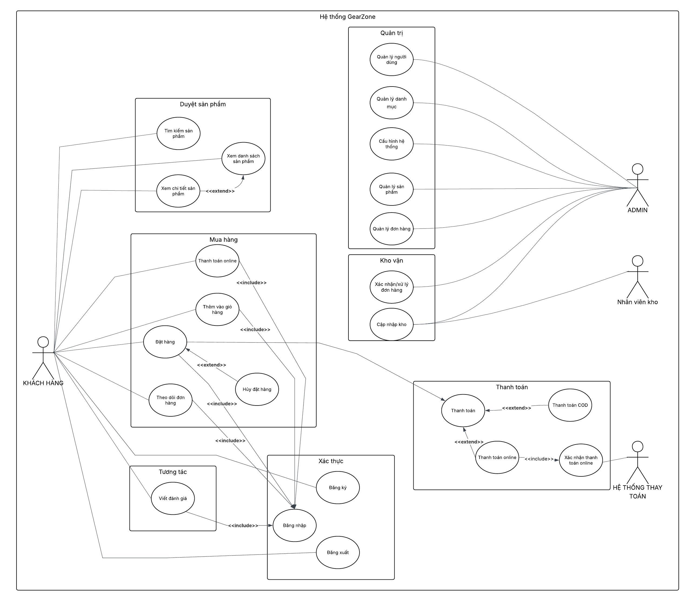
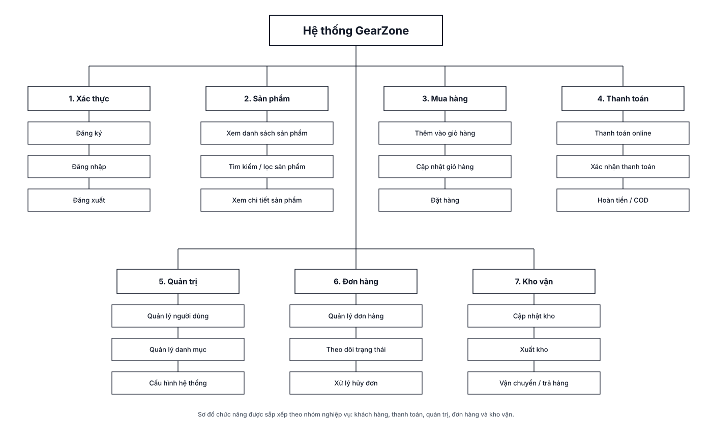
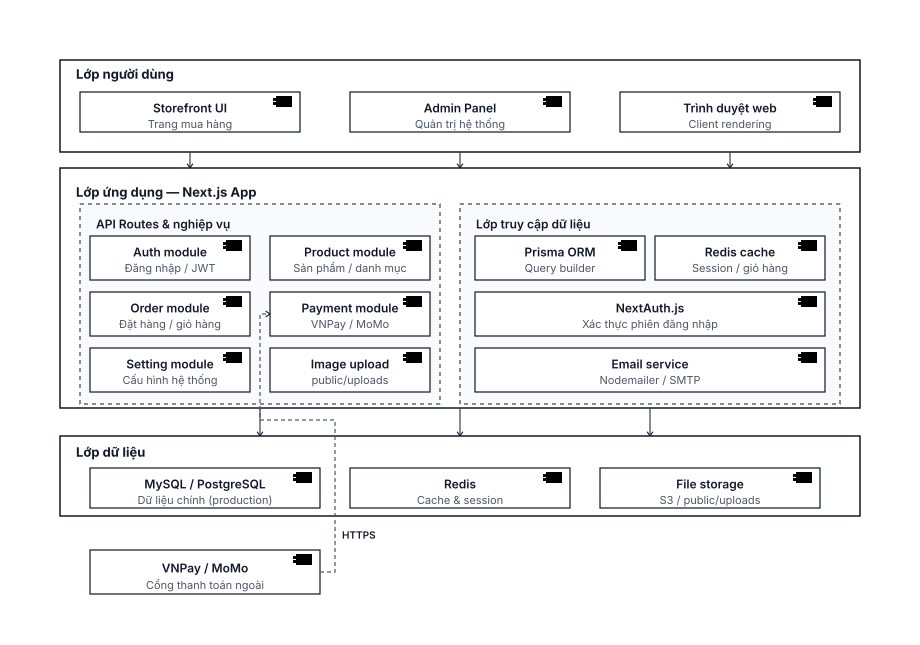
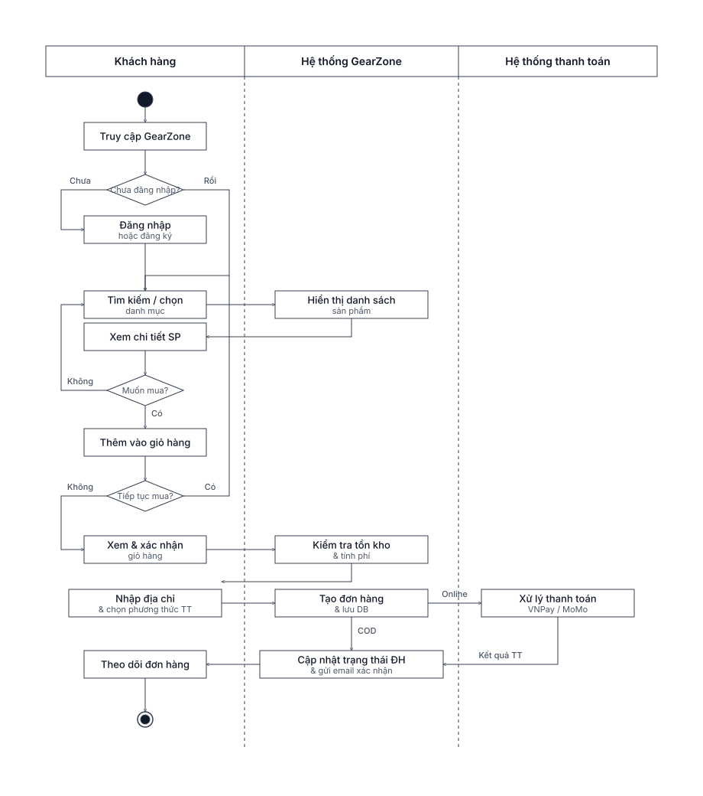
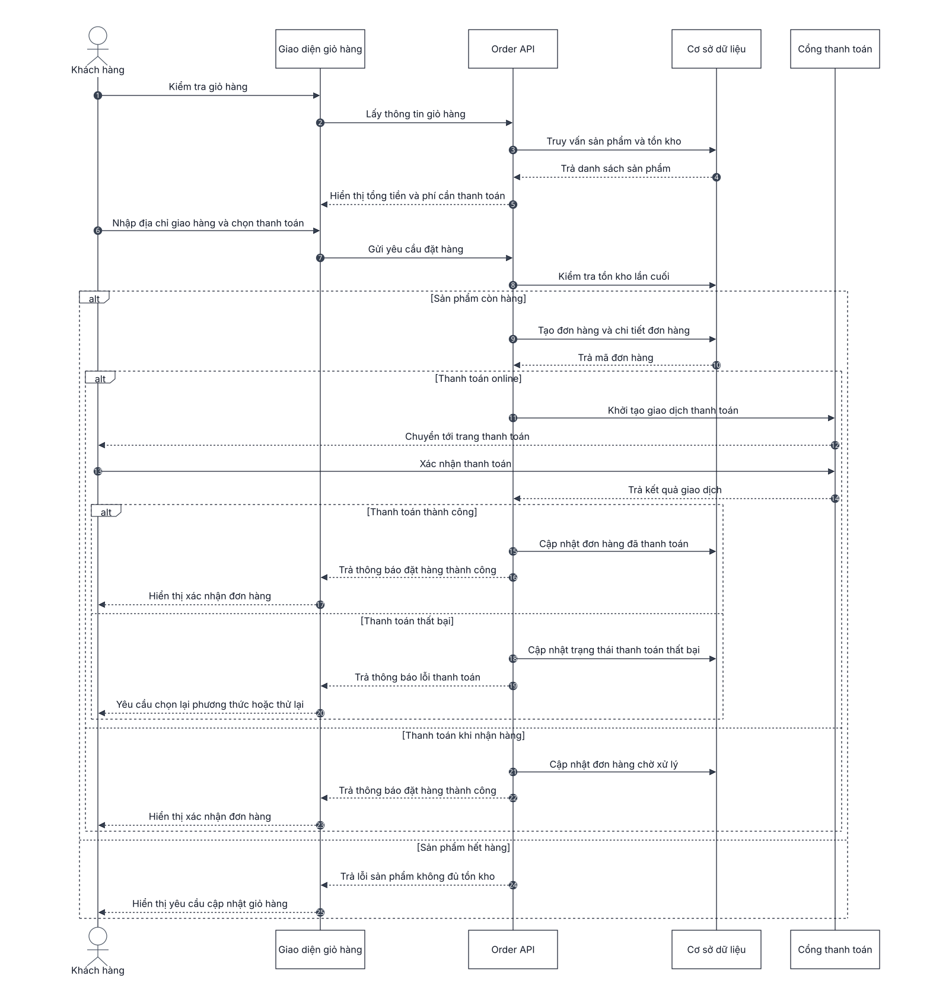
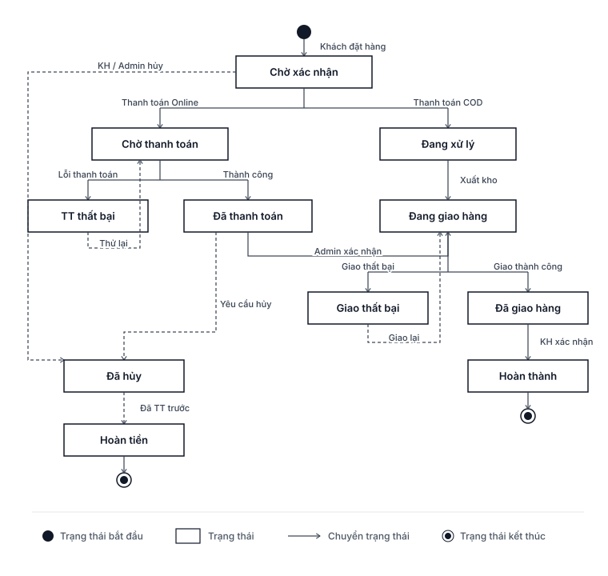
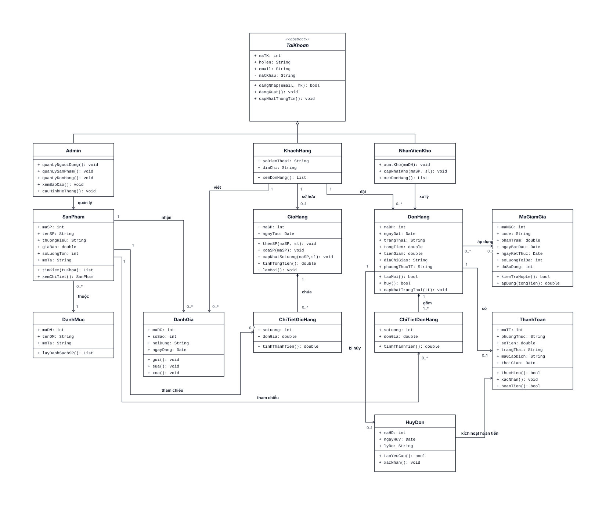
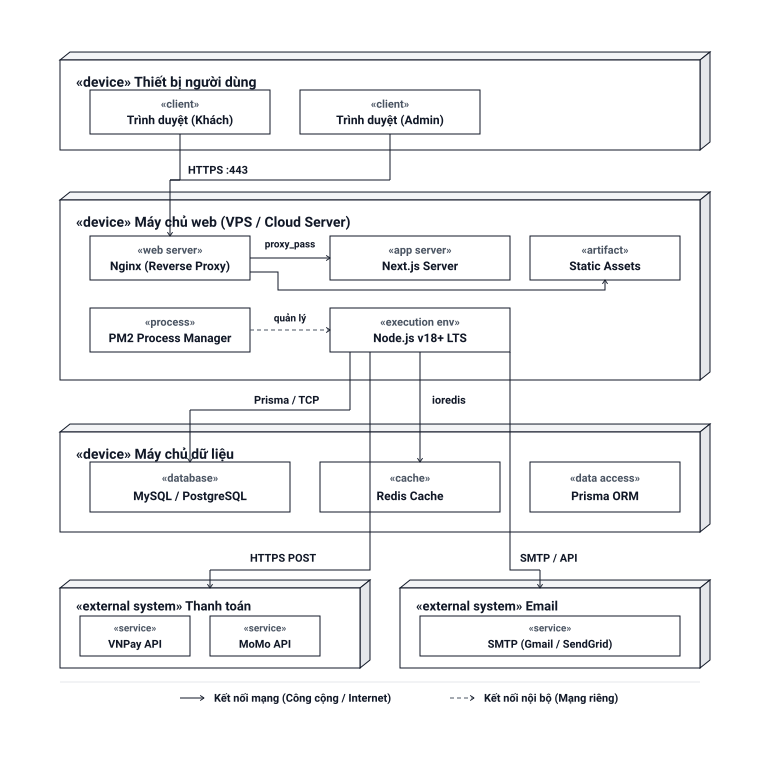

# Gear Zone 🎮

**Nền tảng thương mại điện tử chuyên dụng cho thiết bị chơi game (Gaming Gear).**

## Công nghệ sử dụng

- **Frontend:** Next.js (App Router), React, Tailwind CSS
- **Backend:** Next.js API Routes
- **Database:** SQLite (Dev) / Prisma ORM
- **Authentication:** JWT (jose) + bcrypt
- **Payment:** VietQR, MoMo, PayOS, Sepay

## Kiến trúc hệ thống

### Use Case Diagram

*Sơ đồ use case mô tả các tác nhân và chức năng chính của hệ thống.*

### Sơ đồ chức năng

*Phân rã chức năng của hệ thống Gear Zone.*

### Sơ đồ thành phần

*Các thành phần và mối quan hệ giữa chúng.*

---

## Luồng hoạt động (Workflow)

### Activity Diagram (Đặt hàng)

*Quy trình đặt hàng với swimlane phân chia trách nhiệm giữa các tác nhân.*

### Sequence Diagram (Đặt hàng)

*Luồng tương tác giữa các đối tượng trong quá trình đặt hàng.*

### State Diagram (Đơn hàng)

*Các trạng thái của đơn hàng từ khi tạo đến khi hoàn tất.*

---

## Thiết kế dữ liệu

### Class Diagram


Xem tương tác tại: [Class Diagram (HTML)](images/class_diagram_gearzone.html)

### Chi tiết UML
Xem thêm: [Mô tả UML](images/so_do_UML_gaming_gear.md)

---

## Triển khai

### Deployment Diagram

*Kiến trúc triển khai hệ thống Gear Zone.*

---

## Cài đặt & Chạy

```bash
# Cài đặt dependencies
npm install

# Tạo database
npx prisma db push

# Seed dữ liệu mẫu
npx prisma db seed

# Chạy dev
npm run dev
```

Truy cập: `http://localhost:3000`
