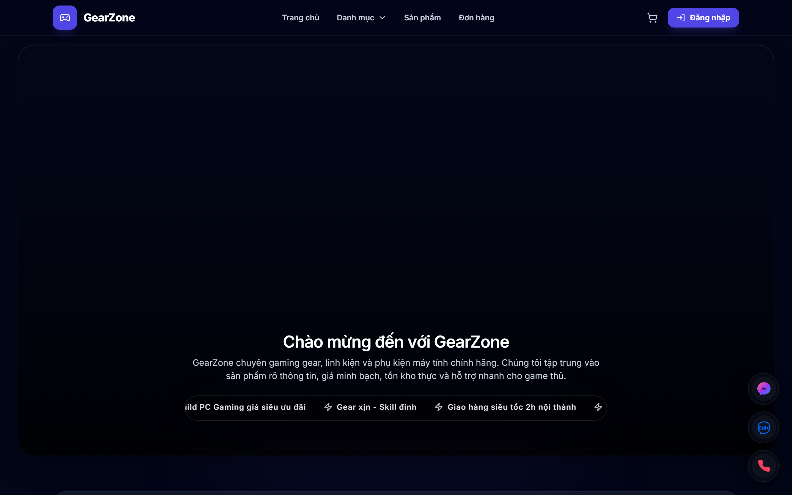
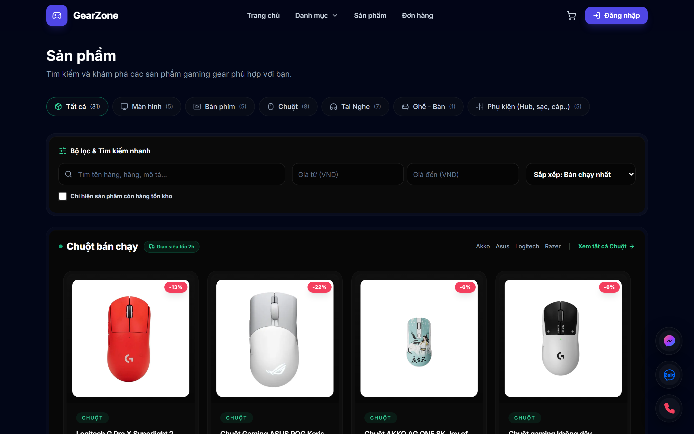
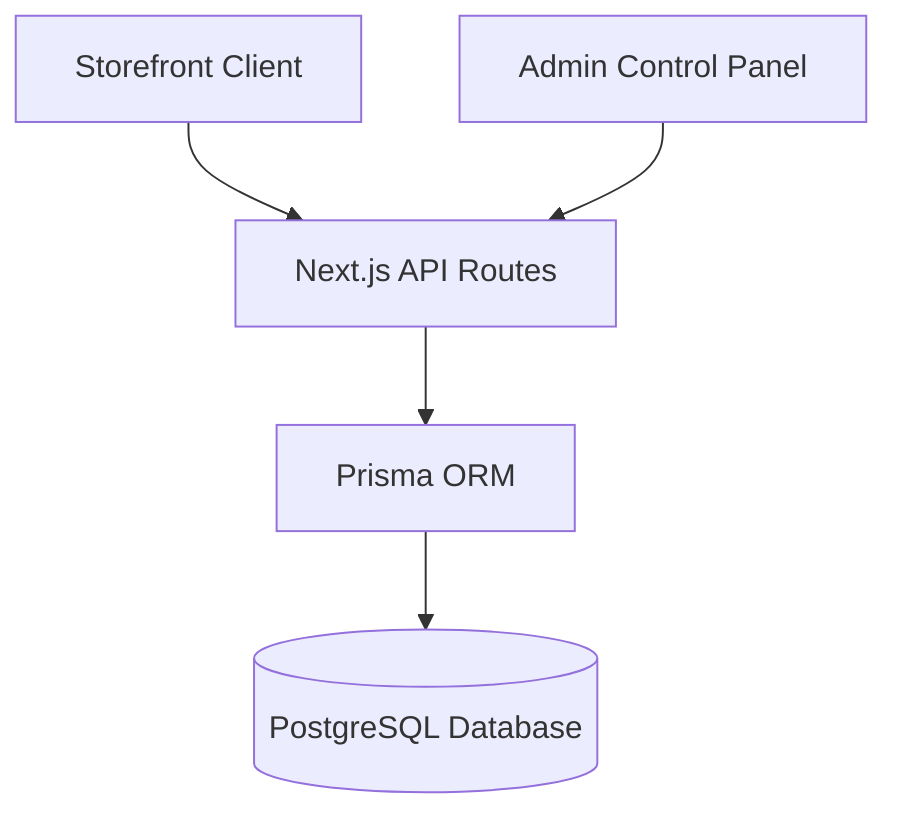
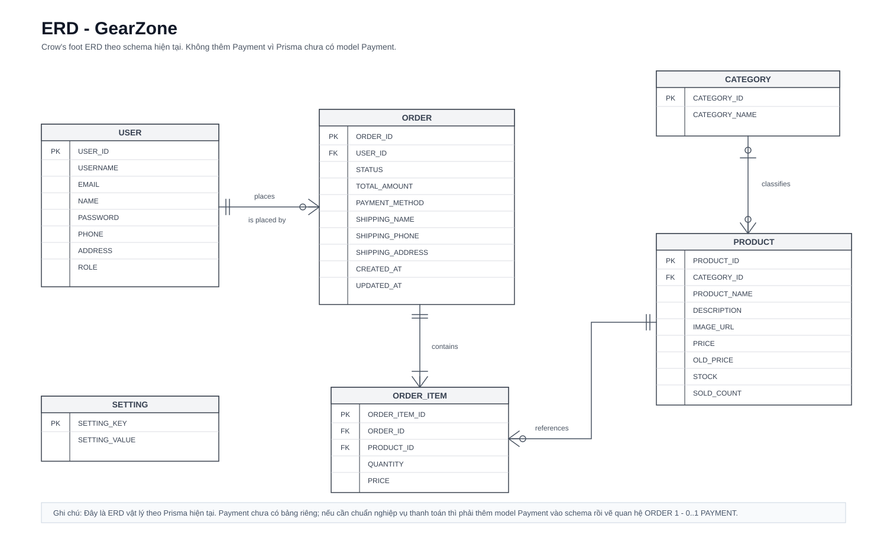

<div align="center">
  <h1>GearZone</h1>
  <h3>A High-Performance E-commerce Engine for Gaming Gear</h3>
  <p>Built with Next.js 15, Prisma, and PostgreSQL.</p>
</div>

<p align="center">
  <a href="#overview">Overview</a> •
  <a href="#features">Features</a> •
  <a href="#architecture--tech-stack">Architecture</a> •
  <a href="#database-schema">Database</a> •
  <a href="#security">Security</a> •
  <a href="#deployment">Deployment</a> •
  <a href="#roadmap">Roadmap</a>
</p>

---

## Overview

GearZone is a robust, direct-to-consumer (B2C) e-commerce platform specifically optimized for gaming peripherals. It provides a complete end-to-end commerce solution, from a high-performance storefront to a feature-rich admin control panel. 

The architecture is built for speed, safety, and extendability, making it suitable for modern production deployments.



---

## 🚀 Features

### Storefront & Catalog
- **Complex Variants:** Support for nested product variants (e.g., Color + Switch Type) with SKU, price, and stock overrides.
- **Smart Filtering:** Dynamic filters based on technical specifications.
- **High Performance:** Server-Side Rendering (SSR) via Next.js App Router.
- **Cart Management:** Persistent shopping cart and checkout flows.



### Admin Dashboard
- **Product Matrix:** Manage hundreds of variants via an intuitive matrix UI.
- **Order Pipeline:** Track orders through customizable statuses.
- **Audit Logging:** Track admin actions for security and compliance.
- **Role-Based Access (RBAC):** Granular permissions for admins and managers.

---

## 🏗 Architecture & Tech Stack

- **Framework:** Next.js 15 (App Router, React 19)
- **Database:** PostgreSQL (Neon)
- **ORM:** Prisma 5
- **Authentication:** Custom JWT (`jose`) + Bcryptjs
- **Testing:** Playwright (End-to-End)
- **Styling:** Tailwind CSS + Framer Motion



---

## 🗄 Database Schema

The platform relies on a heavily normalized database schema to ensure data integrity and prevent race conditions during high-concurrency drops.

- **Products & Variants:** Strict separation between a base `Product` and purchasable `ProductVariant`s.
- **Inventory Resolution:** Stock checks bypass the parent product and resolve strictly against the `ProductVariant`.
- **Order Timeline:** An `OrderTimeline` table creates an immutable ledger of order state changes.



---

## 🔐 Security

Security is treated as a first-class citizen:
- **Obfuscated Admin Routes:** The `/admin` paths are protected by internal rewrites (`NEXT_PUBLIC_ADMIN_PANEL_PREFIX`). Direct access without passing through the hidden gateway drops the connection.
- **Rate Limiting:** Built-in safeguards for newsletter signups and product reviews to prevent abuse.
- **Data Sanitization:** Prisma acts as a protective layer against SQL Injection.
- **Secure Sessions:** HttpOnly cookies using `jose` for robust JWT verification.

---

## 📦 Deployment

GearZone is designed for **Azure Ubuntu VMs** combined with **Neon Serverless PostgreSQL**. 

### Quick Start (Local)

```bash
# 1. Install dependencies
npm install

# 2. Setup Database (SQLite for dev)
npx prisma migrate dev

# 3. Seed initial products
npm run db:seed

# 4. Start Development Server
npm run dev
```

For detailed production deployment instructions, see the [Azure Deployment Guide](docs/azure-ubuntu-neon-deploy.md).

---

## 🗺 Roadmap

- [ ] **Phase 1: Redis Integration** - Replace in-memory rate limits and cart session storage with Upstash/Redis to support distributed environments.
- [ ] **Phase 2: Payment Gateways** - Integrate Webhook-based local payment providers (MoMo / VNPay).
- [ ] **Phase 3: Marketing Engine** - Introduce discount codes, promotional campaigns, and automated abandoned cart emails via Resend.
- [ ] **Phase 4: Browser Automation** - Leverage Playwright for admin workflows, automated stock verification, and competitor monitoring.
