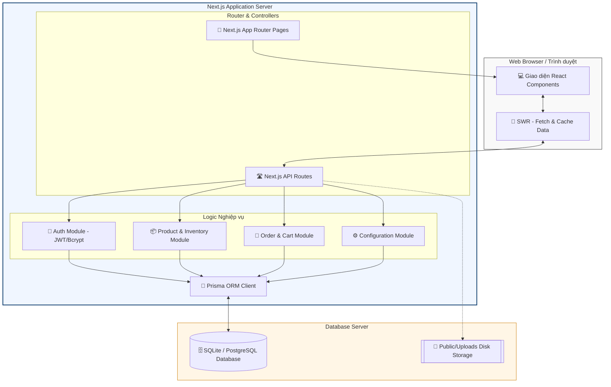
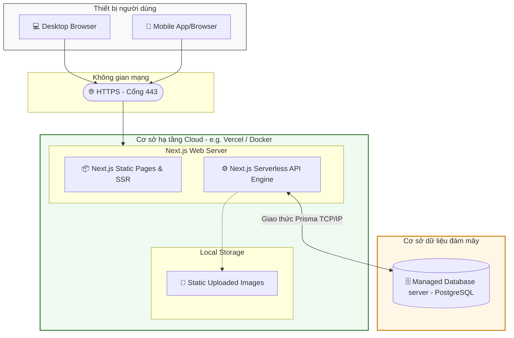

# 🏗️ Kiến Trúc Hệ Thống GearZone

Tài liệu này đặc tả thiết kế kiến trúc kỹ thuật của hệ thống **GearZone**, bao gồm kiến trúc phân tầng (Multi-tier Architecture), sơ đồ thành phần phần mềm (Component Diagram) và sơ đồ triển khai phần cứng (Deployment Diagram).

---

## 1. Tổng Quan Kiến Trúc 3 Lớp (3-Tier Architecture)

GearZone áp dụng mô hình kiến trúc 3 lớp tiêu chuẩn nhằm tách biệt rõ ràng vai trò hiển thị giao diện, xử lý logic nghiệp vụ và lưu trữ dữ liệu:

1. **Presentation Layer (Lớp giao diện)**: 
   - Sử dụng **Next.js/React** kết hợp **TypeScript** và **TailwindCSS** để tạo ra các trang web responsive, tương tác mượt mà và tối ưu hóa SEO.
   - Chia làm hai phân hệ giao diện chính: **Storefront** (dành cho khách hàng mua sắm) và **Admin Console** (dành cho quản lý).
   
2. **Business Logic & Application Layer (Lớp nghiệp vụ)**:
   - Được triển khai thông qua **Next.js API Routes** đóng vai trò là một RESTful API Server thu nhỏ.
   - Chịu trách nhiệm thực thi các logic cốt lõi như tính toán giá trị đơn hàng, kiểm tra số lượng tồn kho khả dụng, xử lý mã hóa mật khẩu (`bcryptjs`) và cấp phát token phiên đăng nhập (`jose/JWT`).

3. **Data Access Layer (Lớp dữ liệu)**:
   - Sử dụng **Prisma ORM** làm cầu nối chuyển đổi dữ liệu dạng Object sang dạng Relational (SQLite/PostgreSQL).
   - Cơ sở dữ liệu sử dụng **SQLite** ở giai đoạn phát triển và dễ dàng chuyển đổi sang **PostgreSQL/MySQL** cho môi trường Production mà không cần thay đổi code nhờ tính trừu tượng của Prisma.

---

## 2. Sơ Đồ Thành Phần Hệ Thống (Component Diagram)

Sơ đồ thành phần mô tả cấu trúc tĩnh của hệ thống, chỉ ra cách các module, thư viện và thành phần giao tiếp tương tác với nhau:

---

## 3. Sơ Đồ Triển Khai Hệ Thống (Deployment Diagram)

Sơ đồ triển khai biểu diễn kiến trúc hạ tầng phần cứng vật lý và các giao thức mạng được sử dụng khi vận hành GearZone trên môi trường thực tế:

---

> [!TIP]
> **Tài liệu tiếp theo**: Mời xem [3. Thiết Kế Cơ Sở Dữ Liệu & ERD](file:///e:/my-project/gear-zone/docs/database.md) để tìm hiểu sâu về sơ đồ dữ liệu chuẩn hóa ERD và cấu trúc các bảng dữ liệu trong hệ thống.
