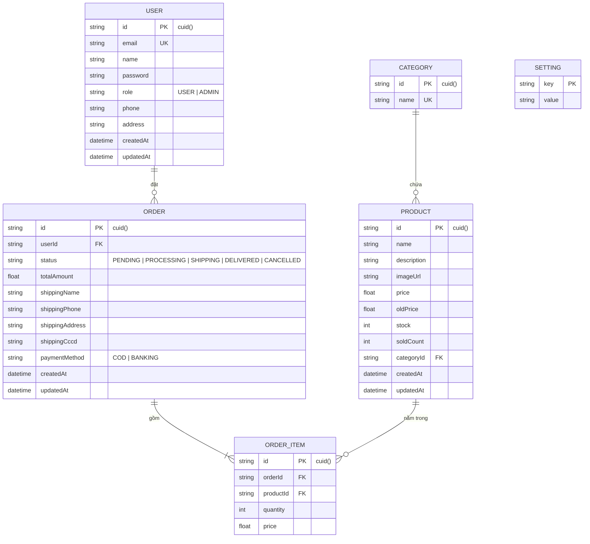

# 🗄️ Thiết Kế Cơ Sở Dữ Liệu & ERD Chuẩn Hóa GearZone

Tài liệu này đặc tả thiết kế cơ sở dữ liệu quan hệ của hệ thống **GearZone**. Cơ sở dữ liệu được thiết kế đạt tiêu chuẩn **dạng chuẩn 3 (3NF)** để giảm thiểu trùng lặp thông tin, đảm bảo tính toàn vẹn dữ liệu và tối ưu hóa tốc độ truy vấn thông qua Prisma ORM.

---

## 1. Sơ Đồ Thực Thể Liên Kết (ERD - Entity Relationship Diagram)

Sơ đồ ERD biểu diễn mối liên kết thực thể (1-n, 1-1, n-n) giữa các bảng trong hệ thống bằng Mermaid JS:



---

## 2. Đặc Tả Chi Tiết Các Bảng Dữ Liệu

### 2.1 Bảng `User` (Thông tin người dùng)
Lưu trữ thông tin cá nhân và tài khoản đăng nhập của cả Khách hàng và Quản trị viên.

| Thuộc tính | Kiểu dữ liệu | Ràng buộc | Ý nghĩa |
|:---|:---|:---|:---|
| `id` | String | PK, CUID | Mã định danh duy nhất của người dùng |
| `email` | String | Unique, Not Null | Địa chỉ email (đồng thời là tên đăng nhập) |
| `name` | String | Not Null | Họ và tên người dùng |
| `password` | String | Not Null | Mật khẩu (đã được mã hóa bằng bcrypt) |
| `role` | String | Default "USER" | Vai trò tài khoản (`USER` hoặc `ADMIN`) |
| `phone` | String | Nullable | Số điện thoại liên hệ |
| `address` | String | Nullable | Địa chỉ giao hàng mặc định |
| `createdAt` | DateTime | Default `now()` | Thời gian tạo tài khoản |
| `updatedAt` | DateTime | Update tự động | Thời gian cập nhật tài khoản gần nhất |

### 2.2 Bảng `Category` (Danh mục sản phẩm)
Phân loại sản phẩm thành chuột gaming, bàn phím, tai nghe...

| Thuộc tính | Kiểu dữ liệu | Ràng buộc | Ý nghĩa |
|:---|:---|:---|:---|
| `id` | String | PK, CUID | Mã danh mục sản phẩm |
| `name` | String | Unique, Not Null | Tên danh mục (e.g. "Bàn Phím Cơ") |

### 2.3 Bảng `Product` (Thông tin sản phẩm)
Lưu chi tiết các thiết bị, giá tiền, hình ảnh và số lượng tồn kho.

| Thuộc tính | Kiểu dữ liệu | Ràng buộc | Ý nghĩa |
|:---|:---|:---|:---|
| `id` | String | PK, CUID | Mã định danh sản phẩm |
| `name` | String | Not Null | Tên sản phẩm gaming gear |
| `description`| String | Nullable | Mô tả chi tiết, thông số kỹ thuật |
| `imageUrl` | String | Nullable | Đường dẫn liên kết đến ảnh sản phẩm |
| `price` | Float | Not Null | Giá bán hiện tại |
| `oldPrice` | Float | Nullable | Giá niêm yết cũ (để tính toán % giảm giá) |
| `stock` | Int | Default 0 | Số lượng còn lại trong kho |
| `soldCount` | Int | Default 0 | Số lượng đã bán ra |
| `categoryId` | String | FK -> Category(id) | Thuộc về danh mục nào |
| `createdAt` | DateTime | Default `now()` | Ngày đăng bán |
| `updatedAt` | DateTime | Update tự động | Ngày cập nhật sản phẩm gần nhất |

### 2.4 Bảng `Order` (Đơn hàng)
Quản lý trạng thái mua hàng, thông tin giao nhận và thanh toán.

| Thuộc tính | Kiểu dữ liệu | Ràng buộc | Ý nghĩa |
|:---|:---|:---|:---|
| `id` | String | PK, CUID | Mã định danh đơn hàng |
| `userId` | String | FK -> User(id) | Người đặt hàng |
| `status` | String | Default "PENDING" | Trạng thái: `PENDING`, `PROCESSING`, `SHIPPING`, `DELIVERED`, `CANCELLED` |
| `totalAmount`| Float | Not Null | Tổng giá trị đơn hàng |
| `shippingName`| String | Nullable | Tên người nhận hàng |
| `shippingPhone`| String | Nullable | Số điện thoại nhận hàng |
| `shippingAddress`| String | Nullable | Địa chỉ nhận hàng |
| `shippingCccd`| String | Nullable | CCCD của khách nhận (nếu yêu cầu xác minh) |
| `paymentMethod`| String | Nullable | Phương thức: `COD` hoặc `BANKING` |
| `createdAt` | DateTime | Default `now()` | Ngày đặt đơn |
| `updatedAt` | DateTime | Update tự động | Ngày cập nhật trạng thái đơn gần nhất |

### 2.5 Bảng `OrderItem` (Chi tiết đơn hàng)
Lưu vết các sản phẩm cụ thể và giá bán tại thời điểm giao dịch của từng đơn hàng.

| Thuộc tính | Kiểu dữ liệu | Ràng buộc | Ý nghĩa |
|:---|:---|:---|:---|
| `id` | String | PK, CUID | Mã định danh chi tiết |
| `orderId` | String | FK -> Order(id) | Liên kết với đơn hàng nào |
| `productId` | String | FK -> Product(id) | Sản phẩm nào được mua |
| `quantity` | Int | Not Null | Số lượng mua |
| `price` | Float | Not Null | Giá bán của 1 sản phẩm tại thời điểm mua |

### 2.6 Bảng `Setting` (Cấu hình hệ thống)
Lưu trữ thông tin tùy chọn tĩnh của hệ thống dưới dạng Key-Value (e.g. Banner, hotline, fanpage).

| Thuộc tính | Kiểu dữ liệu | Ràng buộc | Ý nghĩa |
|:---|:---|:---|:---|
| `key` | String | PK | Tên khóa cấu hình |
| `value` | String | Not Null | Giá trị cấu hình |

---

## 3. Bản Bản Đồ Schema Hiện Thực Hóa Bằng Prisma Schema

Dưới đây là mã nguồn Prisma Schema thực tế được ánh xạ từ cơ sở dữ liệu trên:

```prisma
// e:\my-project\gear-zone\prisma\schema.prisma

generator client {
  provider = "prisma-client-js"
}

datasource db {
  provider = "sqlite"
  url      = env("DATABASE_URL")
}

model User {
  id        String   @id @default(cuid())
  email     String   @unique
  name      String
  password  String
  role      String   @default("USER") // USER | ADMIN
  phone     String?
  address   String?
  createdAt DateTime @default(now())
  updatedAt DateTime @updatedAt
  orders    Order[]
}

model Category {
  id       String    @id @default(cuid())
  name     String    @unique
  products Product[]
}

model Product {
  id          String      @id @default(cuid())
  name        String
  description String?
  imageUrl    String?
  price       Float
  oldPrice    Float?
  stock       Int         @default(0)
  soldCount   Int         @default(0)
  categoryId  String?
  category    Category?   @relation(fields: [categoryId], references: [id])
  orderItems  OrderItem[]
  createdAt   DateTime    @default(now())
  updatedAt   DateTime    @updatedAt
}

model Order {
  id              String      @id @default(cuid())
  userId          String
  user            User        @relation(fields: [userId], references: [id])
  status          String      @default("PENDING") // PENDING | PROCESSING | SHIPPING | DELIVERED | CANCELLED
  totalAmount     Float
  shippingName    String?
  shippingPhone   String?
  shippingAddress String?
  shippingCccd    String?
  paymentMethod   String?
  items           OrderItem[]
  createdAt       DateTime    @default(now())
  updatedAt       DateTime    @updatedAt
}

model OrderItem {
  id        String  @id @default(cuid())
  orderId   String
  order     Order   @relation(fields: [orderId], references: [id], onDelete: Cascade)
  productId String
  product   Product @relation(fields: [productId], references: [id])
  quantity  Int
  price     Float
}

model Setting {
  key   String @id
  value String
}
```

---

> [!TIP]
> **Tài liệu tiếp theo**: Mời xem [4. Hệ Thống Sơ Đồ UML](file:///e:/my-project/gear-zone/docs/uml_diagrams.md) để phân tích các tương tác hệ thống động và tĩnh sử dụng sơ đồ tuần tự và sơ đồ lớp.
