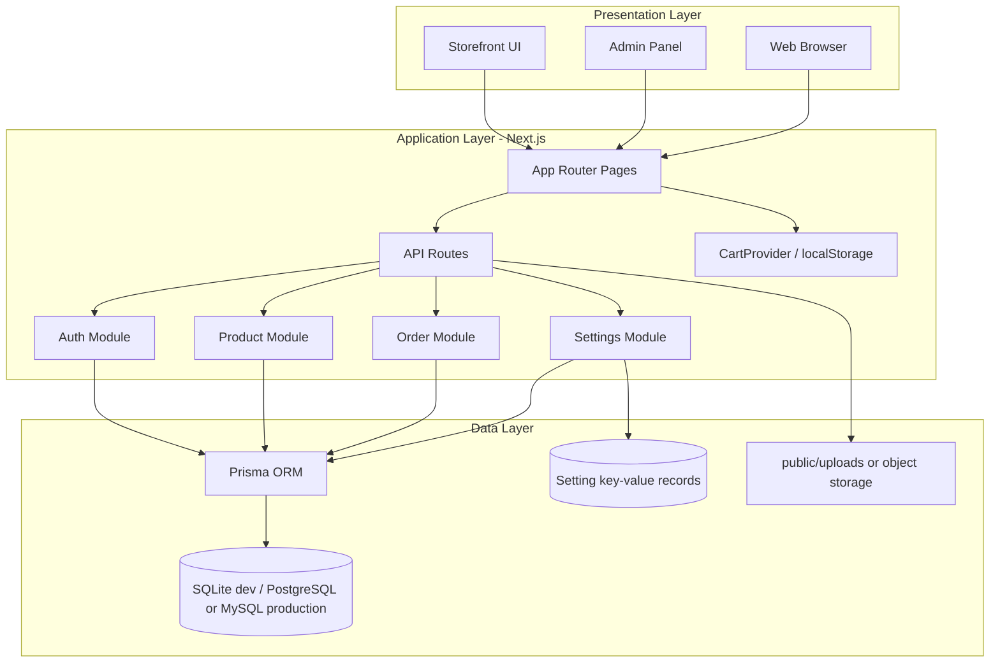
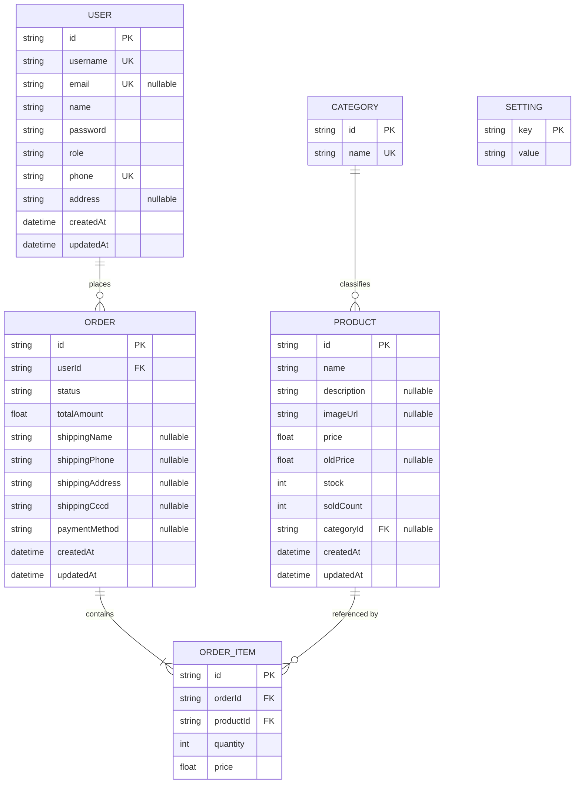
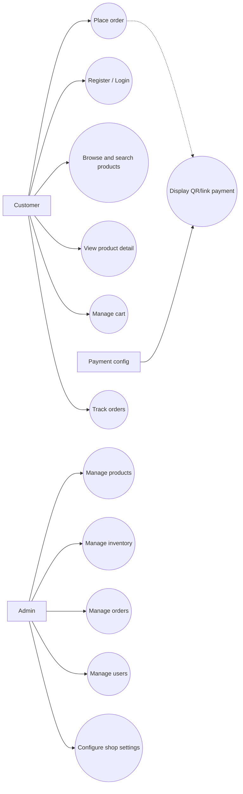
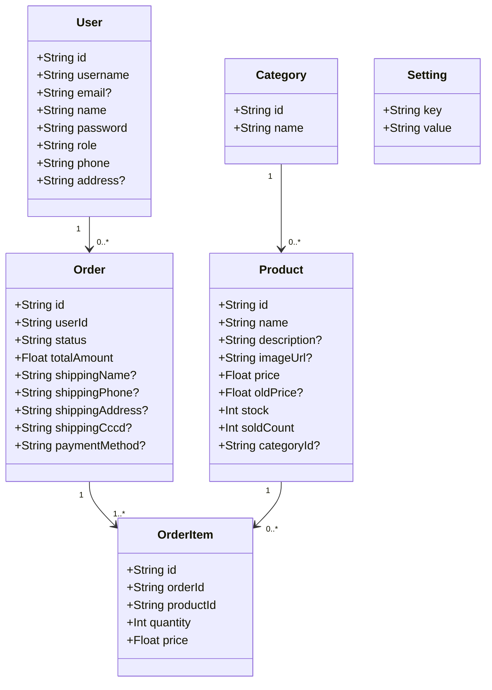
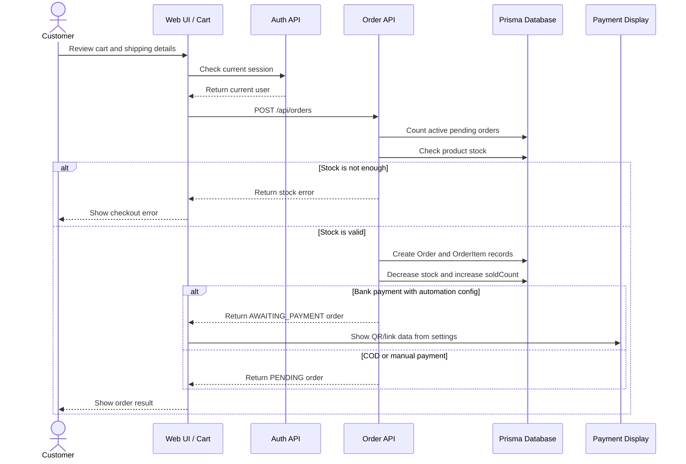
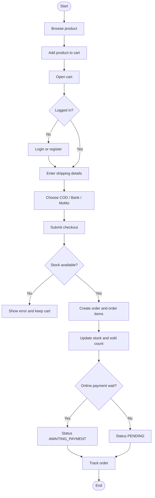
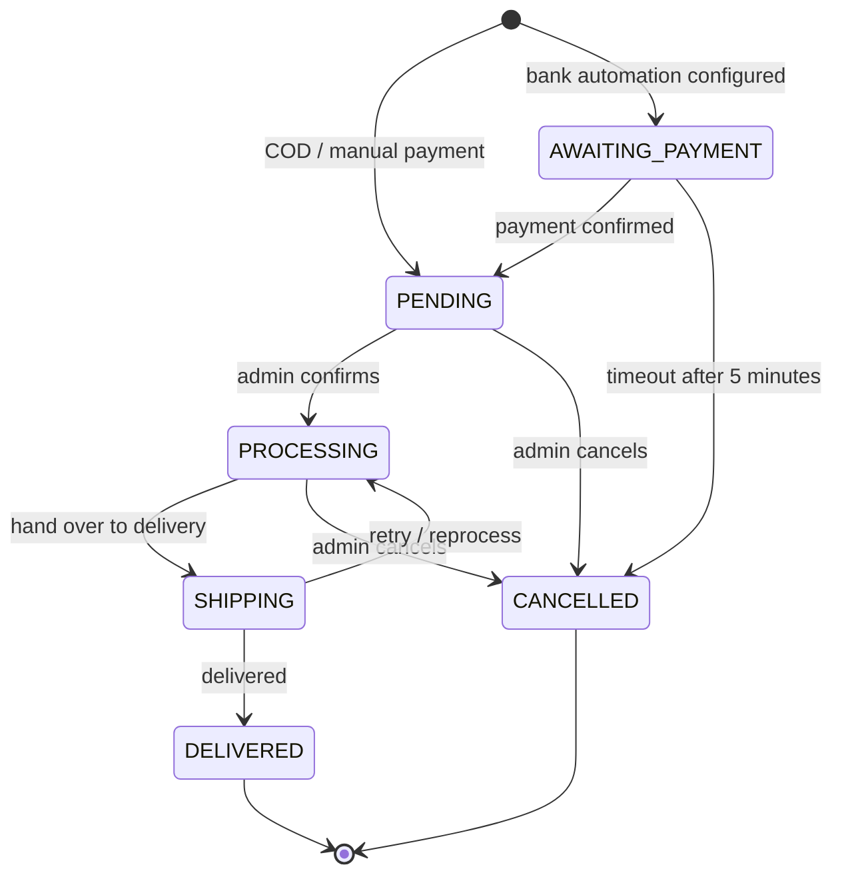
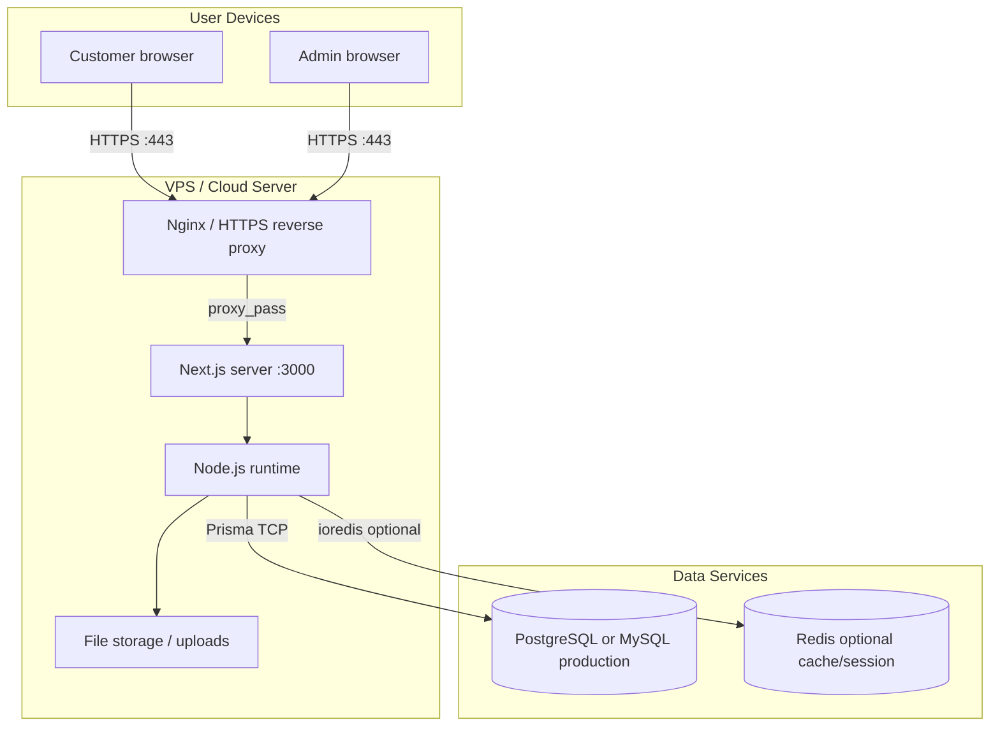

# GearZone System Analysis and Design

This document consolidates the project requirements, architecture, database design, UML diagrams, testing notes, and future direction for GearZone. It is synchronized with the current Next.js and Prisma implementation.

## 1. Project Overview

GearZone is an e-commerce system for gaming gear such as keyboards, mice, headsets, monitors, and PC accessories. The system focuses on product discovery, stock visibility, cart checkout, order tracking, and an admin panel for daily store operation.

### Business Goals

- Help customers browse, search, filter, and buy gaming gear quickly.
- Keep stock and sold count consistent when orders are created.
- Provide an admin panel for managing products, inventory, orders, users, banners, video, contact information, and store settings.
- Keep the implementation simple enough for local development while documenting the production direction clearly.

### Main Actors

| Actor | Role |
|:--|:--|
| Customer | Browses products, manages cart, places orders, tracks order status. |
| Admin | Manages products, inventory, orders, users, and system settings. |
| Payment configuration | Provides QR/link information for bank or MoMo payment display. |

## 2. Functional Requirements

| Module | Main Functions |
|:--|:--|
| Authentication | Register, login, logout, maintain JWT session, protect admin routes. |
| Product catalog | List products, filter/search, view product detail, show stock and sold count. |
| Cart | Add/remove items, update quantity, calculate total price on the client. |
| Checkout | Validate login, validate stock, create order, create order items, update stock. |
| Orders | Customer order history, admin status management, payment waiting timeout. |
| Admin products | Create, update, delete products and upload product images. |
| Admin users | View/search members and roles. |
| Settings | Configure accent color, hero/video, ticker, contact, payment link, SEO/category data. |

## 3. Technical Architecture

GearZone uses a practical 3-tier architecture:

| Layer | Implementation |
|:--|:--|
| Presentation | Next.js App Router, React, Tailwind CSS, storefront pages and admin pages. |
| Application | Next.js API routes for auth, products, categories, orders, admin, settings, uploads. |
| Data | Prisma ORM with SQLite for local development; PostgreSQL/MySQL recommended for production. |

## 4. Database Design

The current database is defined in `prisma/schema.prisma`. There is no separate `Payment`, `Cart`, `CartItem`, or `Review` table at this stage.

### Table Notes

| Table | Purpose |
|:--|:--|
| `User` | Stores customer/admin account data. `username` and `phone` are required unique fields; `email` is optional unique. |
| `Category` | Groups products into product categories. |
| `Product` | Stores product information, price, image, stock, and sold count. |
| `Order` | Stores checkout result, shipping information, status, and selected payment method. |
| `OrderItem` | Stores product lines inside an order. Deleted with its parent order. |
| `Setting` | Stores configurable shop data as key-value records. |

### Implementation Notes

- Cart data is handled by `CartProvider` and browser `localStorage`.
- Payment is represented by `Order.paymentMethod` and settings values for QR/link display.
- Product review data on the product detail page is display/mock data, not persisted in the database.

## 5. UML and Workflow Diagrams

### Use Case Diagram

### Class Diagram

### Checkout Sequence

### Checkout Activity

### Order Status Lifecycle

## 6. Deployment View

## 7. Test Plan

| Case | Module | Expected Result |
|:--|:--|:--|
| TC01 | Auth | Register creates a user with hashed password. |
| TC02 | Auth | Duplicate username/phone/email is rejected. |
| TC03 | Auth | Login returns JWT session data. |
| TC04 | Product | Product list and search return correct results. |
| TC05 | Cart | Add/remove/update quantity updates local cart totals. |
| TC06 | Checkout | Valid checkout creates order and order items. |
| TC07 | Checkout | Out-of-stock checkout is rejected. |
| TC08 | Order | Admin can move order status through the lifecycle. |
| TC09 | Admin | Product CRUD and image upload work for admins only. |
| TC10 | Security | Non-admin users cannot access `/admin/*`. |

## 8. Limitations and Future Work

| Current Limitation | Future Direction |
|:--|:--|
| SQLite is used for local development. | Use PostgreSQL/MySQL in production. |
| Payment is stored as `Order.paymentMethod`; no `Payment` table yet. | Add a `Payment` model if webhook reconciliation is implemented. |
| Cart is client-side only. | Add persisted cart tables if cross-device cart is required. |
| Reviews are display/mock data. | Add `Review` model and moderation workflow. |
| Email notification is not a persisted workflow. | Add email service and notification logs. |

## 9. Source of Truth

- Database source of truth: `prisma/schema.prisma`
- Main application routes: `src/app`
- Domain components and providers: `src/components`
- API routes: `src/app/api`
- Visual diagram assets: `images/*.svg`
