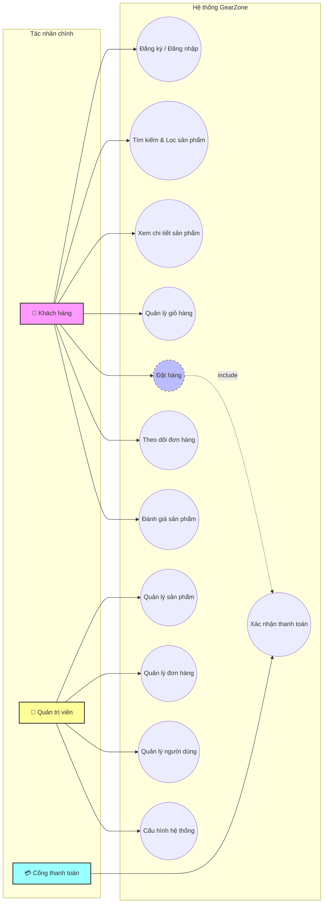

# 📑 Phân Tích Yêu Cầu & Nghiệp Vụ Hệ Thống GearZone

Tài liệu này trình bày chi tiết về quá trình khảo sát hiện trạng, xác định mục tiêu, phân tích các quy trình nghiệp vụ và đặc tả chức năng của hệ thống bán phụ kiện máy tính gaming trực tuyến **GearZone**.

---

## 1. Tổng Quan Nghiệp Vụ

### 1.1 Khảo Sát Hiện Trạng & Thách Thức
Nhóm sản phẩm **Gaming Gear** (bàn phím cơ, chuột gaming, tai nghe, màn hình hiệu năng cao...) đòi hỏi cấu hình kỹ thuật và trải nghiệm trực quan cực kỳ chi tiết:
- Người mua cần so sánh chính xác các thông số kỹ thuật (ví dụ: switch bàn phím, loại cảm biến của chuột, độ trễ, tần số quét màn hình).
- Hệ thống phải hiển thị trạng thái tồn kho chuẩn xác để tránh trường hợp đặt hàng nhưng hết hàng.
- Quy trình mua hàng phải tối giản, nhanh gọn, hỗ trợ đa dạng phương thức thanh toán.

### 1.2 Giải Pháp Của GearZone
**GearZone** hướng tới giải quyết các thách thức trên thông qua:
- Trình bày thông tin sản phẩm trực quan, phân loại danh mục rõ ràng.
- Giao diện tối giản, hiện đại và tập trung vào sản phẩm, tối ưu trải nghiệm trên thiết bị di động (Responsive Layout).
- Phân quyền rõ ràng giữa Khách hàng (User) và Quản trị viên (Admin).
- Tích hợp bộ lọc thông minh giúp tiếp cận nhanh sản phẩm theo nhu cầu cụ thể.

---

## 2. Phân Tích Chức Năng Nghiệp Vụ

Hệ thống được chia thành 5 phân hệ chức năng cốt lõi:

1. **Quản lý người dùng**: Đăng ký, đăng nhập, đăng xuất, quản lý thông tin cá nhân và lịch sử mua hàng.
2. **Duyệt và tìm kiếm sản phẩm**: Xem danh sách theo danh mục, tìm kiếm theo từ khóa, lọc theo mức giá và đánh giá sản phẩm.
3. **Quản lý giỏ hàng**: Thêm/xóa sản phẩm, cập nhật số lượng và tính toán tổng chi phí tự động.
4. **Quy trình đặt hàng**: Nhập địa chỉ nhận hàng, chọn phương thức thanh toán (COD hoặc chuyển khoản), tạo và theo dõi tiến trình đơn hàng.
5. **Quản trị hệ thống (Admin Panel)**: Dashboard thống kê, CRUD sản phẩm/danh mục, quản lý đơn hàng (phê duyệt, giao hàng, hủy đơn), phân quyền tài khoản, cấu hình banner/video và cài đặt hệ thống.

---

## 3. Sơ Đồ Chức Năng Hệ Thống (Functional Flowchart)

Sơ đồ dưới đây trực quan hóa sự phân rã chức năng từ hệ thống tổng quát xuống các module con chi tiết:

```mermaid
flowchart TD
    A[Hệ thống GearZone] --> B[Quản lý người dùng]
    A --> C[Quản lý sản phẩm]
    A --> D[Quản lý giỏ hàng]
    A --> E[Quản lý đơn hàng]
    A --> F[Quản trị hệ thống]

    B --> B1[Đăng ký tài khoản]
    B --> B2[Đăng nhập / Đăng xuất]
    B --> B3[Cập nhật profile cá nhân]

    C --> C1[Xem danh sách sản phẩm]
    C --> C2[Tìm kiếm và lọc bộ lọc]
    C --> C3[Xem chi tiết thông số]
    C --> C4[Đánh giá & Bình luận]

    D --> D1[Thêm vào giỏ hàng]
    D --> D2[Cập nhật số lượng]
    D --> D3[Xóa sản phẩm khỏi giỏ]

    E --> E1[Tạo đơn hàng mới]
    E --> E2[Thanh toán & Xác nhận]
    E --> E3[Theo dõi trạng thái giao hàng]

    F --> F1[Quản lý Sản phẩm & Danh mục]
    F --> F2[Quản lý Đơn hàng & Vận chuyển]
    F --> F3[Quản lý Người dùng & Quyền]
    F --> F4[Cấu hình Giao diện & Hệ thống]
    
    style A fill:#003366,stroke:#333,stroke-width:2px,color:#fff
    style B fill:#006699,stroke:#333,stroke-width:1px,color:#fff
    style C fill:#006699,stroke:#333,stroke-width:1px,color:#fff
    style D fill:#006699,stroke:#333,stroke-width:1px,color:#fff
    style E fill:#006699,stroke:#333,stroke-width:1px,color:#fff
    style F fill:#006699,stroke:#333,stroke-width:1px,color:#fff
```

---

## 4. Sơ Đồ Use Case Tổng Quát

Sơ đồ Use Case thể hiện sự tương tác giữa các tác nhân chính (**Khách hàng**, **Quản trị viên**, **Cổng thanh toán**) với các tính năng của hệ thống GearZone:

---

> [!TIP]
> **Tài liệu tiếp theo**: Mời xem [2. Kiến Trúc Hệ Thống](file:///e:/my-project/gear-zone/docs/architecture.md) để hiểu rõ cách các module chức năng này được hiện thực hóa trong mô hình 3 lớp của website.
