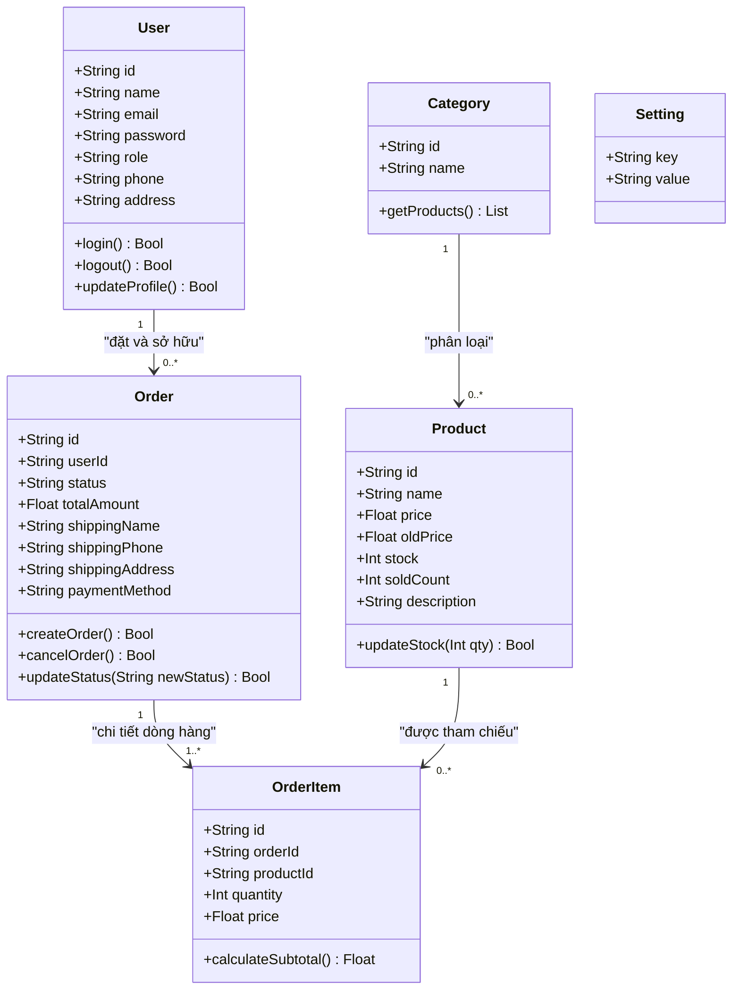
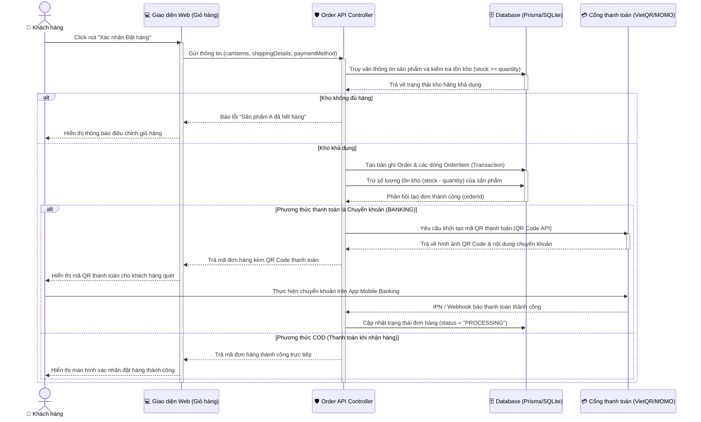
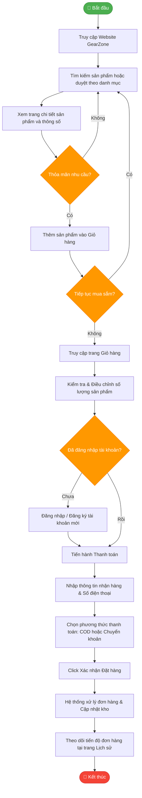
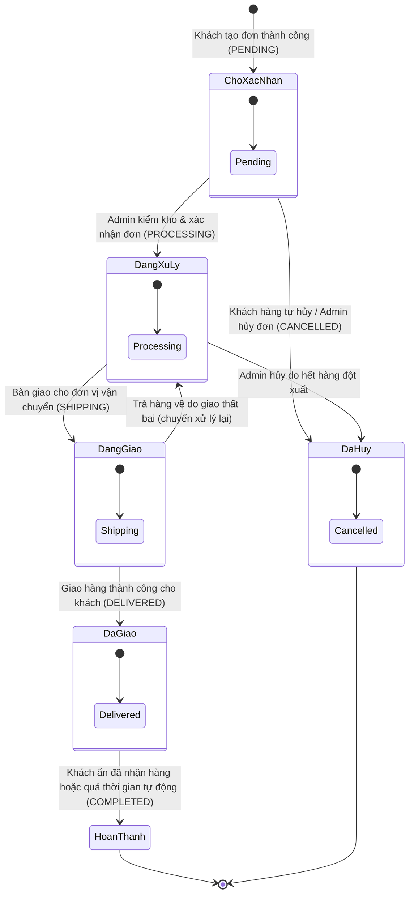

# 📊 Hệ Thống Sơ Đồ UML GearZone

Tài liệu này đặc tả chi tiết về cấu trúc tĩnh và hành vi động của hệ thống **GearZone** thông qua các sơ đồ UML (Unified Modeling Language) được xây dựng bằng cú pháp Mermaid JS.

---

## 1. Sơ Đồ Lớp (Class Diagram)

Sơ đồ lớp mô tả cấu trúc tĩnh của hệ thống, chỉ rõ các lớp đối tượng, các thuộc tính, phương thức và mối quan hệ giữa chúng (kế thừa, kết hợp, phụ thuộc):

---

## 2. Sơ Đồ Tuần Tự Đặt Hàng (Sequence Diagram)

Sơ đồ tuần tự thể hiện sự tương tác theo trình tự thời gian giữa các tác nhân và đối tượng khi thực hiện quy trình nghiệp vụ phức tạp nhất: **Quy trình đặt hàng**:

---

## 3. Sơ Đồ Hoạt Động Mua Hàng (Activity Diagram)

Sơ đồ hoạt động biểu diễn luồng công việc (workflow) tuần tự, các rẽ nhánh điều kiện từ lúc người dùng bắt đầu truy cập đến lúc hoàn tất đơn mua hàng:

---

## 4. Sơ Đồ Trạng Thái Đơn Hàng (State Diagram)

Sơ đồ trạng thái mô tả vòng đời của một Đơn hàng trong cơ sở dữ liệu, biểu diễn các trạng thái tĩnh và các sự kiện gây ra sự chuyển dịch trạng thái:

---

> [!TIP]
> **Tài liệu tiếp theo**: Mời xem [5. Kiểm Thử & Đánh Giá](file:///e:/my-project/gear-zone/docs/testing_and_conclusion.md) để xem bảng ma trận kiểm thử phần mềm cho toàn bộ các quy trình trên.
