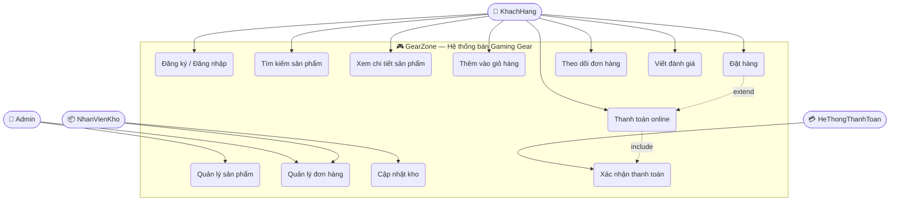
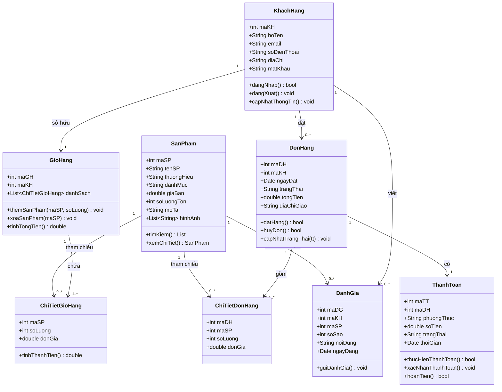
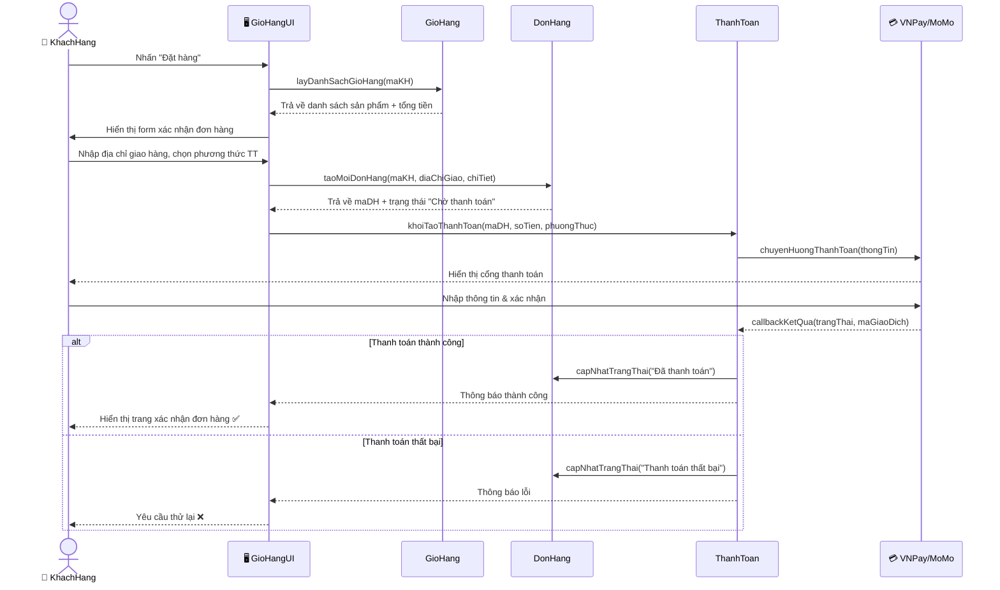
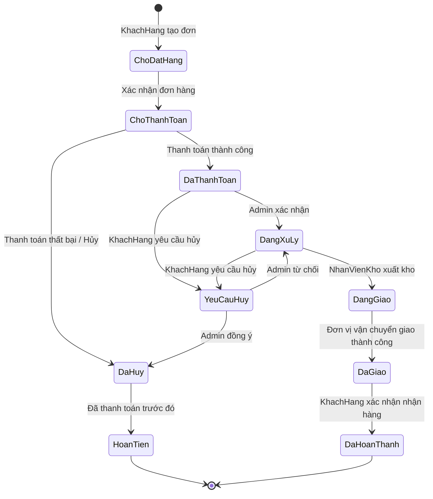
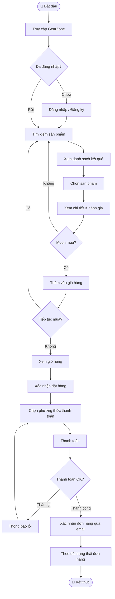
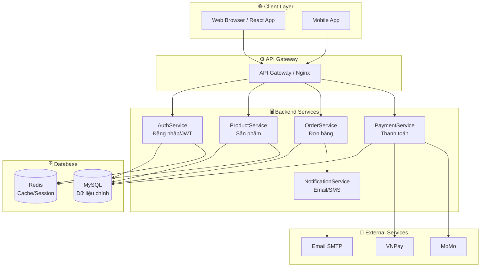
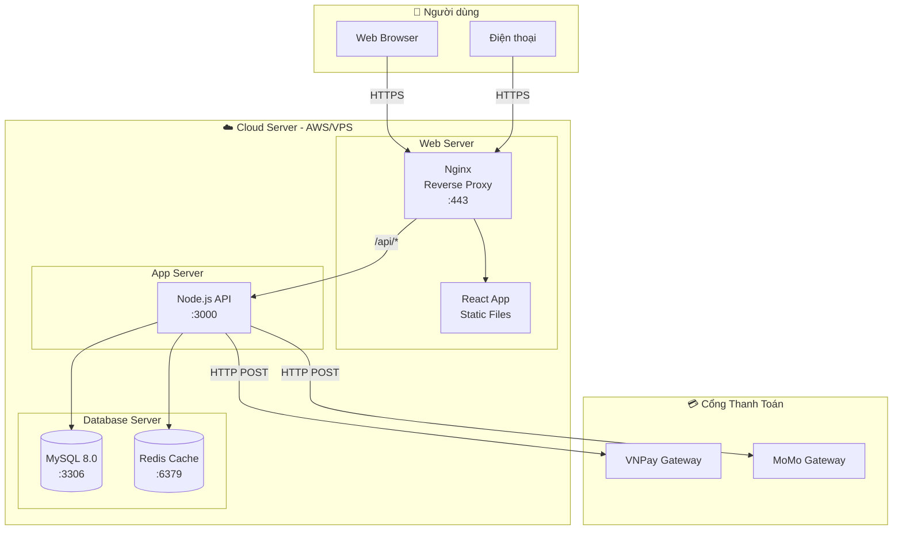

# Phân Tích & Thiết Kế Hướng Đối Tượng — Tài Liệu & Ví Dụ Web Bán Gaming Gear

---

## 1. Thống Kê Sơ Đồ Trong Tài Liệu

Tài liệu **"Phân tích thiết kế hướng đối tượng"** (179 trang) chứa tổng cộng **~126 hình/sơ đồ**, phân bổ theo từng loại UML như sau:

| Loại sơ đồ | Số lượng | Chương |
|---|---|---|
| Sơ đồ quy trình phát triển phần mềm (Waterfall, Tăng trưởng, Xoắn ốc) | 4 | Chương 1 |
| Sơ đồ ký hiệu UML cơ bản (lớp, đối tượng, gói, ràng buộc...) | ~23 | Chương 2 |
| **Biểu đồ ca sử dụng (Use Case Diagram)** | ~8 | Chương 3 |
| **Biểu đồ lớp (Class Diagram)** | ~14 | Chương 4 |
| **Biểu đồ trình tự (Sequence Diagram)** | ~6 | Chương 5 |
| **Biểu đồ trạng thái (State Diagram)** | ~5 | Chương 5 |
| **Biểu đồ hoạt động (Activity Diagram)** | ~3 | Chương 5 |
| **Biểu đồ cộng tác (Collaboration Diagram)** | ~24 | Chương 6 |
| **Biểu đồ thành phần & triển khai (Component/Deployment)** | ~4 | Chương 7 |
| Sơ đồ kiến trúc & cài đặt (code generation) | ~12 | Chương 7 |

> **Tổng: ~126 hình/sơ đồ** (đánh số từ Hình 1.1 → Hình 7.12)

---

## 2. Ví Dụ Áp Dụng: Website Bán Gaming Gear

**Hệ thống:** GearZone — website thương mại điện tử bán gaming gear (chuột, bàn phím, tai nghe, màn hình gaming) cho game thủ.

**Các tác nhân chính:**
- `KhachHang` — game thủ mua sản phẩm
- `Admin` — quản trị viên hệ thống
- `NhanVienKho` — nhân viên kho
- `HeThongThanhToan` — cổng thanh toán (VNPay, MoMo)

---

## 3. Biểu Đồ Ca Sử Dụng (Use Case Diagram)

---

## 4. Biểu Đồ Lớp (Class Diagram)

---

## 5. Biểu Đồ Trình Tự (Sequence Diagram) — Ca Sử Dụng "Đặt Hàng & Thanh Toán"

---

## 6. Biểu Đồ Trạng Thái (State Diagram) — Vòng Đời Đơn Hàng

---

## 7. Biểu Đồ Hoạt Động (Activity Diagram) — Quy Trình Tìm Kiếm & Mua Hàng

---

## 8. Biểu Đồ Thành Phần (Component Diagram) — Kiến Trúc Hệ Thống

---

## 9. Biểu Đồ Triển Khai (Deployment Diagram)

---

*Tài liệu tham khảo: "Phân tích thiết kế hướng đối tượng" — 179 trang, ~126 hình minh họa UML*
